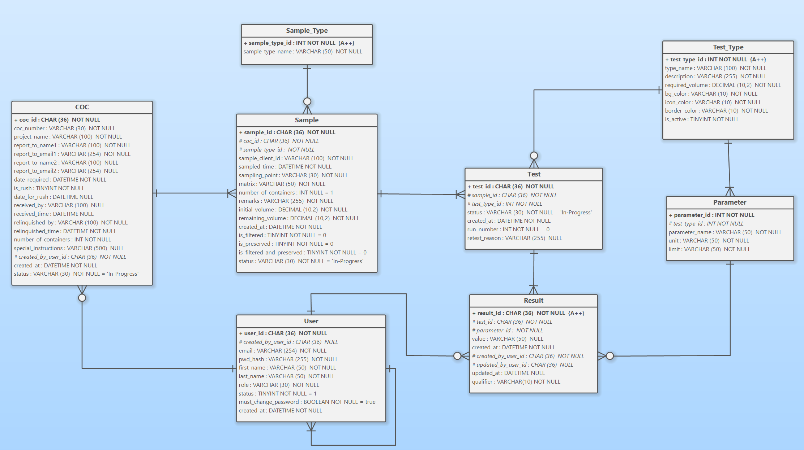
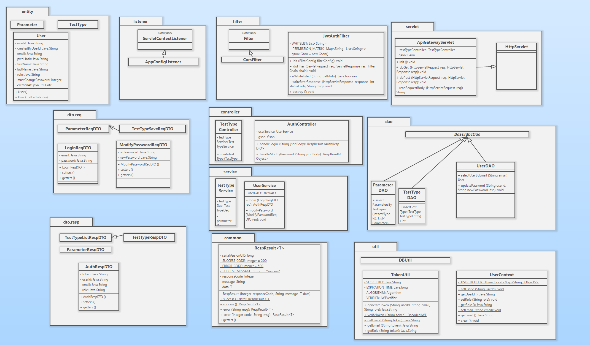
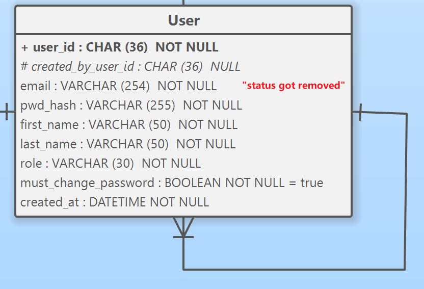
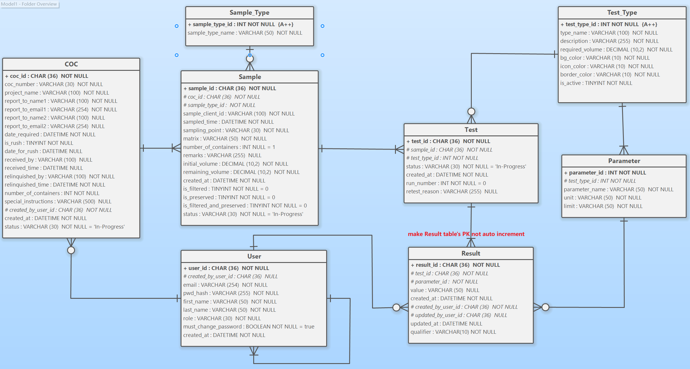
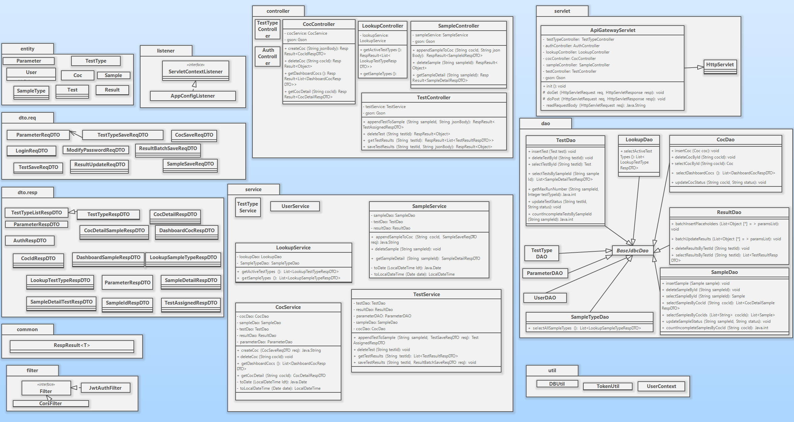

# LIMS Technical Architecture Document (TAD)

## Global Foundations[v]()

**This section defines the core architectural principles for the LIMS system. All development must strictly adhere to the following boundaries and contracts.**

### 1. System Topology & Tech Stack Boundaries

The system adopts a strict decoupled frontend-backend architecture. Component responsibilities are clearly defined, and overstepping boundaries is strictly prohibited:

- **Core Tech Stack:**

  - **Frontend:** Next.js (Reagct), Tailwind CSS, MUI
  - **Backend:** Java 8, Tomcat 9.0.x (Servlet 4.0), Pure JDBC (No ORM), Gson 2.9.0
  - **Database:** MySQL 8.0.x
  - **Connection Pool:** HikariCP 4.0.x (Selected for Java 8 compatibility)
  - **Package Manager:** Maven 3.9.x
- **Frontend Layer (Next.js / React):**

  - **Sole Responsibility:** UI rendering, routing, user input validation, and state management.
  - **Strict Rule:** The frontend must never construct SQL or contain core business logic. All data must be fetched via HTTP APIs.
- **Backend Layer (Java Servlet API):**

  - **Sole Responsibility:** Acts as a stateless API gateway and business logic executor. It receives requests, validates permissions, enforces business rules, and coordinates database interactions.
  - **Architectural Decision (Zero Framework):** The backend is built **strictly without the Spring ecosystem** (No Spring Boot, or Spring Data/Hibernate).
  - **Rationale:** To facilitate deep foundational learning for junior developers, avoiding heavy enterprise frameworks prevents reliance on black-box annotations (e.g., `@Transactional`, `@RestController`). Using pure **Servlets** and **JDBC** forces the team to thoroughly understand the raw HTTP request lifecycle, manual database connection pooling, and explicit transaction boundaries.
- **Persistence Layer (MySQL):**

  - **Sole Responsibility:** Ensures data persistence and relational integrity (e.g., foreign key constraints).
  - **Strict Rule:** The database acts as storage. Complex state logic (e.g., "Status A cannot change to Status B") must be handled in Java. The use of complex **triggers** or **stored procedures** is prohibited.

### 2. The 3-Tier Architecture Rules

Java backend code must strictly follow a unidirectional dependency chain: `Controller -> Service -> DAO`. **Bypassing layers is strictly prohibited** (e.g., a Servlet must never call a DAO directly).

- **Controller (Servlet Layer):**
  - **I/O:** Only responsible for parsing HTTP JSON requests into `ReqDTO`s and wrapping the output in a `RespResult<T>`**(It is strictly forbidden for the Controller layer to return database entities)**.
  - **Restriction:** Absolutely no business logic (e.g., state-checking `if-else` statements) or JDBC code is allowed here.
- **Service (Business Logic Layer):**
  - **Core:** The heart of the system. Converts `ReqDTO`s to `Entity` objects and executes all business validation rules.
  - **Composition:** A Service method can (and often must) call multiple DAOs to fulfill a complete Use Case.
- **DAO (Data Access Layer):**
  - **Purity:** Exclusively executes basic CRUD SQL statements. Maps Java `Entity` objects to SQL parameters and JDBC `ResultSet`s back to Java `Entity` objects.
  - **Restriction:** The DAO layer must remain pure and contain zero business logic.

### 3. Data Architecture & Database Standards

To maintain clean and consistent data, all database designs and operations must follow 3 standards:

- **ERD Baseline:** All table creations and modifications must strictly align with the approved ERD. Unapproved column additions are forbidden.
- **Naming Conventions:** All database tables and columns must use **snake_case** (e.g., `test_type_id`, `required_volume`).
- **Primary Key Strategy:** Transactional tables (e.g., COC, Sample, Test, Result) use `CHAR(36)` for UUIDs. Configuration dictionary tables (e.g., Test_Type, Parameter) use auto-incrementing `INT` primary keys.

### 4. Cross-Cutting Concerns & Protocol

To eliminate frontend-backend integration friction, CORS, exceptions, and API responses must be handled via unified mechanisms:

- **Global Response Wrapper:**

  - Every HTTP API response (whether successful or an exception) must be wrapped in the `RespResult<T>` structure.

  ```
  {
    "responseCode": 200,          // 200 for success, 400/500 for errors
    "message": "Operation desc",  // Developer-friendly message
    "data": { ... }               // Payload of generic type T (can be null on error)
  }
  ```
- **CORS & Core Filter Mechanism:**

  - To support direct client-side fetching from Next.js, the backend must implement a global `CorsFilter`.
  - **Filter Order Rule:** `CorsFilter` MUST be placed **first** in the filter chain (before `JwtAuthFilter`). This ensures browser `OPTIONS` preflight requests are permitted immediately; otherwise, cross-origin requests will fail entirely.
- **Exception & Logging Handling:**

  - Raw `SQLException` stack traces must never be exposed to the frontend.
  - Exceptions must be caught(try-catch) in the `Service` or `Controller` layer, and converted into a `responseCode: 500` `RespResult` to return to the client.

### 5. Transaction & Connection Management

In a pure JDBC environment, to prevent data inconsistency during multi-table operations, the Service layer must govern all transactions. To keep DAO method signatures clean and decoupled, we utilize the **ThreadLocal pattern** to bind the active database connection to the current HTTP request thread.

- **HikariCP Pool Initialization:** \* The `HikariDataSource` must be initialized as a singleton during application startup (e.g., via a `ServletContextListener`).
  - Key pool configurations (e.g., `maximumPoolSize`, `minimumIdle`, `idleTimeout`, and `connectionTimeout`) must be externalized in a `db.properties` file.
- **Connection Binding & Pooling Behavior:** \* The Service layer initiates a database operation by calling `DBUtil.getConnection()`.
  - `DBUtil` checks if the current thread already holds a connection in its `ThreadLocal` variable. If not, it borrows a connection **from the HikariCP pool** , binds it to the thread, and returns it.
- **Transaction Boundary:** The Service method explicitly calls `conn.setAutoCommit(false)` to begin the transaction.
- **Implicit Propagation:** DAO methods **do not** require a `Connection` parameter. Inside the DAO, calling `DBUtil.getConnection()` will automatically return the exact same connection bound by the Service layer, ensuring both operate within the same transaction scope.
- **Commit, Rollback, and Strict Cleanup:**
  - On success, the Service layer calls `conn.commit()`.
  - On an exception, the Service layer calls `conn.rollback()` in the `catch` block.
  - ⚠️ **CRITICAL RULE (Memory Leak Prevention):** Whether successful or not, the Service layer MUST use a `finally` block to call `DBUtil.closeConnection()`. This utility method must call `conn.close()` (which **returns the connection back to the HikariCP pool** rather than destroying it) and **strictly execute `ThreadLocal.remove()`** . Failure to clear the thread context will pollute Tomcat's thread pool, causing catastrophic transaction leaks and connection pool exhaustion.

## Sprint 1

### 0. Class diagram & ERD for Spring 1




### 1. Architectural Overview

The backend of this Laboratory Information Management System (LIMS) is designed using a strict **N-Tier Architecture** implemented entirely with pure Java Servlets and JDBC, deliberately excluding heavy enterprise frameworks like Spring Boot. This approach ensures maximum runtime execution efficiency, absolute control over low-level infrastructure, and a highly transparent request-processing lifecycle.

The system enforces a clean separation of concerns through the following layers:

- **Ingress & Security Layer (Filter & Listener):** Handles cross-origin requests, global application initialization, and infrastructure bootstrapping.
- **Unified Routing Layer (Gateway Servlet):** Coordinates request ingestion, payload parsing, and sub-controller delegation.
- **Presentation & Coordination Layer (Controller):** Standardizes API responses, maps transport payloads, and handles HTTP-level concerns.
- **Core Business Logic Layer (Service):** Manages enterprise business rules, enforces transaction boundaries, and acts as an anti-corruption translator.
- **Data Access Layer (DAO):** Isolates native SQL execution, handles JDBC parameter binding, and encapsulates row mapping.

### 2 .Core Architectural Patterns

#### 2.1 Front Controller Pattern & Unified Ingress

- **Component:** `ApiGatewayServlet`
- **Design Philosophy:** To circumvent the "servlet explosion" problem typical of traditional Java Web development—where every unique endpoint demands a distinct servlet class—the architecture channels all API traffic through a single ingress gateway. The `ApiGatewayServlet` captures inbound HTTP requests (`doGet`, `doPost`), centrally parses incoming JSON payloads via the `Gson` library, and dynamically delegates execution to the appropriate business controller (e.g., `TestTypeController`).

#### 2.2 Anti-Corruption Layer Data Isolation

- **Component:** `dto` (Data Transfer Objects) vs. `entity` (Domain Entities)
- **Design Philosophy:** Domain objects inside the `entity` package (such as `TestType` and `Parameter`) represent pure, immutable 1:1 mappings of the physical database schema. Data payloads coming from or sent to the client are isolated within separate `dto.req` and `dto.resp` structures. The Service layer acts as the absolute translator, unpacking Request DTOs and converting them into Entities before passing them down to DAOs. This decouples the core database design from front-end UI contract changes.

#### 2.3 Generic Reflection DAO Infrastructure

- Component: `BaseJdbcDao`
- Design Philosophy: Writing repetitive boilerplate code for manual mapping (rs.getString, rs.getBigDecimal) is eliminated by abstracting JDBC complexities. By leveraging Java Reflection, generics `<T>`, and an internal underscoreToCamelCase naming convention adapter, BaseJdbcDao dynamically inspects column metadata from the database `ResultSet` and reconstructs target Java objects on the fly, reducing boilerplate operations by over 90%.

#### 2.4 Thread-Bound Transaction Management

- Component: `DBUtil` powered by ```HikariCP Connection Pool
- Design Philosophy: To maintain database consistency during complex data changes (e.g., updating a test type alongside its dependent parameter list), multi-statement updates must execute within a atomic unit of work. By wrapping a high-performance HikariCP datasource with a `ThreadLocal<Connection>`wrapper, the system guarantees that all distinct DAO method invocations within the same HTTP request thread share the exact same physical database connection. Transaction management boundaries (`setAutoCommit(false)`, `commit()`, `rollback()`) are strictly controlled at the Service layer.

### 3.Component Interaction Flow (Sprint 1: Test Type Management)

To illustrate the data flow and execution path across these layers, the handling of a write operation (such as adding or differentially updating a test type with nested configuration options) executes as follows:

1. Bootstrapping & Filtering: Upon server startup, AppConfigListener triggers DBUtil.initPool() to initialize HikariCP. Incoming API calls pass through CorsFilter to resolve cross-origin policies.
2. Ingress Mapping: ApiGatewayServlet intercepts the request, reads the raw string payload, and deserializes it into a request container (TestTypeSaveReqDTO).
3. Controller Orchestration: TestTypeController captures the DTO and handles response packaging by wrapping downstream data inside a unified RespResult<T></t> wrapper.
4. Service Processing & Transaction Boundary: TestTypeService fetches a connection via DBUtil.getConnection() and disables auto-commit.

- It translates the core ReqDTO into a pure TestType entity and saves it via TestTypeDAO, capturing the generated primary key.
- It reads the nested parameters, triggers a Differential Update (Diffing) Algorithm to compare the inbound array against existing DB rows, and dynamically marks elements for targeted INSERT, UPDATE, or DELETE.
- It maps parameter DTO items into Parameter entities, sets their foreign keys, and saves them sequentially using ParameterDAO.
- If any SQL exception occurs, it executes conn.rollback(); otherwise, it executes conn.commit() and closes the connection back to the pool via the finally block.

5. Data Persistence: TestTypeDAO and ParameterDAO execute clean, parameter-bound SQL strings through parent template methods (executeInsertAndReturnKey, executeUpdate), abstracting low-level connectivity from business rules.

## Sprint 2

### 1. Overview & UMLs

The core objective of this iteration (Sprint 2) is to introduce **Stateless Authentication and Role-Based Access Control (RBAC)** to the LIMS system.
Under the strict architectural constraint of "Pure Servlet + JDBC, zero heavyweight frameworks", we have built a lightweight, secure, and high-performance security gateway defense line. This sprint successfully implements user login, password modification, and privilege-downgrade control for core business APIs.





### 2. Architecture Evolution

Building upon the C-S-D (Controller-Service-DAO) foundational flow established in Sprint 1, Sprint 2 focuses on introducing a **Global Security Filter Layer** and a **Thread-Level Context Isolation Container**.

- **Inbound Traffic Routing**: All HTTP requests now pass through the `CorsFilter` (Cross-Origin) -> `JwtAuthFilter` (Authentication & Interception) -> `ApiGatewayServlet` (Routing Dispatch).
- **Context Penetration**: The `UserContext` safely passes the user's identity information down to the Service layer, achieving complete decoupling of business logic from the HTTP protocol.

### 3. Core Component Design

#### 3.1 Authentication & Security Gateway (`JwtAuthFilter`)

Acting as the system's supreme security customs, it implements a four-step defense mechanism:

1. **Static Whitelist**: Bypasses token checks for public routes such as `/api/auth/login`.
2. **Token Verification**: Intercepts all non-whitelist requests, extracts the `Authorization: Bearer <token>` header, and invokes `TokenUtil` for cryptographic and expiration validation.
3. **Permission Matrix**: Maintains an in-memory mapping of `URL Prefix -> Allowed Roles`. For instance, access to `/test-types` is strictly restricted to `ADMIN` and `SUPER_ADMIN` roles. Unauthorized access is immediately blocked with a `403 Forbidden` response.
4. **Context Lifecycle Management**: Upon successful verification, user information is injected into the current thread. **It is mandatory to execute `UserContext.clear()` in the `finally` block to completely eliminate memory leaks and identity cross-contamination caused by Tomcat thread pool reuse.**

#### 3.2 Token Infrastructure (`TokenUtil`)

- **Dependency Selection**: Integrated the ultra-lightweight Auth0 `java-jwt` library.
- **Cryptographic Algorithm**: Utilizes the symmetric encryption algorithm `HMAC SHA-256`.
- **Payload Design**: The token encapsulates `userId`, `email`, and `role`, achieving true stateless authentication without the need for backend Session maintenance.

#### 3.3 Thread Context Isolation (`UserContext`)

- Implemented based on `ThreadLocal<Map<String, Object>>`.
- Provides static methods (e.g., `UserContext.getUserId()`) for downstream Controllers and Services to safely and transparently obtain the current operator's identity. This avoids the code pollution of passing `User` objects through method signatures.

### 4. Data Persistence Layer

#### 4.1 User Entity Mapping (`User` & `UserDAO`)

- **Primary Key Strategy**: Uses `CHAR(36)` to store UUIDs in the database, mapped to `String` in the Java entity.
- **Pure DAO**: `UserDAO` strictly extends `BaseJdbcDao`. It contains only pure data read/write methods (`selectUserByEmail` and `updatePassword`) and is completely devoid of business logic.

#### 4.2 Underlying ORM Engine Enhancement (`BaseJdbcDao` Patch)

To accommodate the characteristics of the MySQL 8.0+ JDBC driver, the underlying reflection assembly engine received an advanced type-adaptation upgrade:

1. **Time Type Downgrade**: Smartly intercepts `java.time.LocalDateTime` returned by the underlying driver and safely converts it to the `java.util.Date` required by the entity.
2. **Boolean Compatibility**: Perfectly supports bidirectional mapping from `TINYINT(1)` to Java `Integer` or `Boolean`, significantly enhancing the framework's robustness.

### 5. Core Business Flows

#### 5.1 User Login (`/api/auth/login`)

1. The gateway receives the request and deserializes it into a `LoginReqDTO`.
2. `UserService` dispatches `UserDAO` to fetch the user record by email.
3. Executes password comparison (Plaintext comparison for Sprint 2; the architecture has reserved space for future BCrypt integration).
4. Upon successful comparison, `TokenUtil` is invoked to issue a JWT, which is then encapsulated and returned as an `AuthRespDTO`.

#### 5.2 Modify Password (`/api/auth/password`)

- **Defense-in-Depth Design**: To prevent Horizontal Privilege Escalation (ID tampering), the `ModifyPasswordReqDTO` payload **strictly prohibits the inclusion of the `userId` field**.
- **Execution Flow**: `UserService` forcefully extracts the absolutely trusted `userId` and `email` (already verified by the gateway) from the `UserContext`. After validating the old password, it physically updates the database with the new password and resets the `must_change_password` flag to 0.

### 6. Architectural Red Lines & Security Disciplines

1. **Strictly Prohibited** to call `close()` on a `Connection` inside `BaseJdbcDao`. The lifecycle of database connections is exclusively managed by `DBUtil` and the transaction boundaries within the Service layer.
2. **Strictly Prohibited** to pass user identity identifiers within DTOs for non-whitelist APIs. The backend must rely entirely on `UserContext`.
3. **Strictly Prohibited** to omit the invocation of `UserContext.clear()` at the end of a request lifecycle.

## Sprint 3: Core Business Flows and Complex Aggregate Architecture

### 1. Overview
Sprint 3 represents the most critical business flow of the LIMS system, covering the full lifecycle management from Chain of Custody (COC) creation, Sample receiving, and Test task assignment, to Result data entry.
In this iteration, the system faced significant challenges, including **multi-table cascading operations, strict foreign key constraints, high-frequency batch I/O, and complex hierarchical status transitions**. While strictly adhering to the architectural red line of "Pure Servlet + JDBC, zero heavyweight frameworks," we deeply refactored the underlying data access base class (`BaseJdbcDao`) and introduced advanced architectural design patterns such as in-memory aggregation and status rollup, ensuring both high performance and strong data consistency.






### 2. Core Architectural Upgrades

#### 2.1 High-Performance Batch Processing Engine
To address the high-frequency write scenarios in API 6 (Placeholder Generation) and API 10 (Batch Save Results), we introduced the `executeBatchUpdate` method into `BaseJdbcDao`.
*   **Technical Details:** We discarded inefficient `for`-loop single `INSERT/UPDATE` statements and fully adopted native JDBC `PreparedStatement.addBatch()` and `executeBatch()`. By packaging massive SQL statements and submitting them to MySQL via a single network I/O, we drastically reduced database connection overhead and row-lock contention time.

#### 2.2 Scalar Query Engine
For aggregate function queries like `COUNT()` and `MAX()`, we designed a dedicated generic method: `executeQueryForScalar`.
*   **Pain Point Resolved:** Completely circumvented the reflection instantiation crashes caused by basic wrapper classes (e.g., `Integer`, `Long`) lacking no-argument constructors.
*   **Downcasting Fault Tolerance:** Addressed the underlying pitfall where the MySQL JDBC driver defaults `COUNT()` returns to `java.lang.Long`. We introduced an intelligent downcasting logic based on the `Number` superclass, ensuring the DAO layer's single-line calls remain minimalist and elegant.

#### 2.3 Ultimate Defensive Reflection
To equip our lightweight ORM engine with enterprise-grade fault tolerance, we executed an ultimate refactoring of the reflection mapping logic in `BaseJdbcDao`:
1.  **Collection Boundary Defense:** Explicitly intercepts and skips properties of type `List` / `Collection`. This enforces the rule that "multi-dimensional" aggregate relationships must be assembled in-memory at the Service layer, clearly defining the physical mapping boundaries of the DAO layer.
2.  **Bidirectional Time Adaptation:** Perfectly accommodates seamless conversions between the underlying driver's `java.time.LocalDateTime` / `java.sql.Timestamp` and the entity class's `java.util.Date`.
3.  **Numeric and Boolean Degradation:** Implemented intelligent and safe degradation from `BIGINT` to `Integer`, and `TINYINT(1)` to `Boolean` / `Integer`.

#### 2.4 Global Serialization Adapter
Registered a global bidirectional `TypeAdapter` for `java.time.LocalDateTime` within the `ApiGatewayServlet`'s Gson instance.
*   **Technical Details:** Uniformly serializes backend `LocalDateTime` objects into frontend-friendly `"yyyy-MM-dd HH:mm:ss"` formatted strings. It also incorporates fault tolerance for empty strings `""` during deserialization, thoroughly guaranteeing Type Security at the DTO layer.

### 3. Key Business Scenarios Implementation

#### 3.1 Hierarchical Aggregate Creation
In API 4 (Create COC), we implemented a cascading creation of tree-structured data up to 4 levels deep.
*   **Primary Key Strategy:** Fully adopted `UUID.randomUUID().toString()` to pre-generate primary keys in Java memory. This eliminates the dependency on database auto-increment IDs, making batch insertions and parent-child table associations highly efficient.
*   **Placeholder Pre-population:** When assigning Test tasks, the system automatically fetches the Parameter blueprint and cascade-inserts Result placeholders with `value = null`. This allows subsequent result entries (API 10) to be downgraded to lightweight `UPDATE` operations, avoiding `INSERT` table-lock risks under high concurrency.

#### 3.2 Status Rollup Mechanism
In API 10 (Batch Save Results), we implemented a bottom-up status-driven engine.
*   **Technical Details:** When a lab technician submits results (`isComplete: true`), the system first marks the current Test as `Completed`. It then triggers a rollup validation: using scalar queries (`COUNT`), it checks if any incomplete Tests remain under the same Sample. If none, the Sample is marked as `Completed`, and the check bubbles up to the COC root node. Pure string hardcoding (`"Completed"`) is used throughout, eliminating serialization and coupling issues associated with Enums.

#### 3.3 Cascade Physical Deletion
For the deletion operations in APIs 3, 7, and 8, strict adherence to relational database Foreign Key Constraints is maintained.
*   **Execution Strategy:** Within a single transaction, a **strict reverse-order deletion strategy** is employed (Result -> Test -> Sample -> COC).
*   **Empty Payload Tolerance:** The Controller layer directly ignores the parsing of the DELETE request body, perfectly circumventing Gson parsing exceptions caused by the frontend sending empty objects `{}`.

#### 3.4 Anti-N+1 In-Memory Aggregation
In API 11 (Dashboard COCs), to ensure ultimate above-the-fold loading performance on the homepage, traditional N+1 loop queries were completely abandoned.
*   **Technical Details:**
    1.  Utilized SQL `LEFT JOIN` and `SUM(CASE WHEN...)` to directly compute the total and completed Test counts at the database layer.
    2.  Extracted all COC IDs and used an `IN (...)` clause to fetch all associated Samples in a single query.
    3.  Utilized `HashMap` in the Service layer for In-Memory Assembly. This strictly limits database I/O calls to exactly 2, achieving highly efficient assembly with an O(N) time complexity.

### 4. Security & Audit Trail
Fully integrated the `UserContext` thread context isolation container established in Sprint 2.
*   **Transparent Auditing:** When executing any creation (`INSERT`) or update (`UPDATE`) operations, the Service layer forcefully extracts the current operator's ID via `UserContext.getUserId()`.
*   **Strict Differentiation:** During data initialization, only `created_by_user_id` is written. During result entry (API 10), `updated_by_user_id` and `updated_at` are precisely updated. This achieves 100% tamper-proof audit traceability for lab data, without requiring (or allowing) the frontend to pass any user identifiers in the payload.

### 5. Architectural Red Lines Compliance
1.  **Absolute Transaction Boundaries:** All write operations initiate transactions via `conn.setAutoCommit(false)` in the Service layer and strictly execute `DBUtil.closeConnection()` within the `finally` block, achieving zero connection leaks.
2.  **Unified Exception Funneling:** The Controller layer fully wraps executions in `try-catch` blocks, converting all underlying `SQLException`s or business exceptions into standard `RespResult.error(500, msg)`. This completely blocks the leakage of sensitive stack trace information to the frontend.
