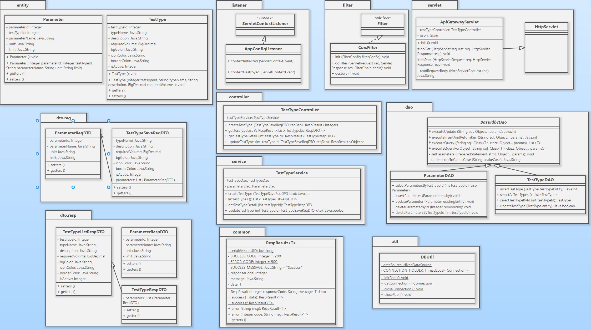

i

# LIMS Technical Architecture Document (TAD)

## Global Foundations

**This section defines the core architectural principles for the LIMS system. All development must strictly adhere to the following boundaries and contracts.**

### 1. System Topology & Tech Stack Boundaries

The system adopts a strict decoupled frontend-backend architecture. Component responsibilities are clearly defined, and overstepping boundaries is strictly prohibited:

- **Core Tech Stack:**
  - **Frontend:** Next.js (Reagct), Tailwind CSS, MUI
  - **Backend:** Java 8, Tomcat 9.0.x (Servlet 4.0), Pure JDBC (No ORM), Gson 2.9.0
  - **Database:** MySQL 8.0.x
  - **Connection Pool:** HikariCP 4.0.x (Selected for Java 8 compatibility)
  - **Package Manager:** Maven 3.9.x

- **Frontend Layer (Next.js / React):**
  - **Sole Responsibility:** UI rendering, routing, user input validation, and state management.
  - **Strict Rule:** The frontend must never construct SQL or contain core business logic. All data must be fetched via HTTP APIs.

- **Backend Layer (Java Servlet API):**
  - **Sole Responsibility:** Acts as a stateless API gateway and business logic executor. It receives requests, validates permissions, enforces business rules, and coordinates database interactions.
  - **Architectural Decision (Zero Framework):** The backend is built **strictly without the Spring ecosystem** (No Spring Boot, or Spring Data/Hibernate).
  - **Rationale:** To facilitate deep foundational learning for junior developers, avoiding heavy enterprise frameworks prevents reliance on black-box annotations (e.g., `@Transactional`, `@RestController`). Using pure **Servlets** and **JDBC** forces the team to thoroughly understand the raw HTTP request lifecycle, manual database connection pooling, and explicit transaction boundaries.

- **Persistence Layer (MySQL):**
  - **Sole Responsibility:** Ensures data persistence and relational integrity (e.g., foreign key constraints).
  - **Strict Rule:** The database acts as storage. Complex state logic (e.g., "Status A cannot change to Status B") must be handled in Java. The use of complex **triggers** or **stored procedures** is prohibited.

### 2. The 3-Tier Architecture Rules

Java backend code must strictly follow a unidirectional dependency chain: `Controller -> Service -> DAO`. **Bypassing layers is strictly prohibited** (e.g., a Servlet must never call a DAO directly).

- **Controller (Servlet Layer):**
  - **I/O:** Only responsible for parsing HTTP JSON requests into `ReqDTO`s and wrapping the output in a `RespResult<T>`**(It is strictly forbidden for the Controller layer to return database entities)**.
  - **Restriction:** Absolutely no business logic (e.g., state-checking `if-else` statements) or JDBC code is allowed here.
- **Service (Business Logic Layer):**
  - **Core:** The heart of the system. Converts `ReqDTO`s to `Entity` objects and executes all business validation rules.
  - **Composition:** A Service method can (and often must) call multiple DAOs to fulfill a complete Use Case.
- **DAO (Data Access Layer):**
  - **Purity:** Exclusively executes basic CRUD SQL statements. Maps Java `Entity` objects to SQL parameters and JDBC `ResultSet`s back to Java `Entity` objects.
  - **Restriction:** The DAO layer must remain pure and contain zero business logic.

### 3. Data Architecture & Database Standards

To maintain clean and consistent data, all database designs and operations must follow 3 standards:

- **ERD Baseline:** All table creations and modifications must strictly align with the approved ERD. Unapproved column additions are forbidden.
- **Naming Conventions:** All database tables and columns must use **snake_case** (e.g., `test_type_id`, `required_volume`).
- **Primary Key Strategy:** Transactional tables (e.g., COC, Sample, Test, Result) use `CHAR(36)` for UUIDs. Configuration dictionary tables (e.g., Test_Type, Parameter) use auto-incrementing `INT` primary keys.
- **Enum Mapping:** Status values are stored as `VARCHAR` in MySQL and mapped to strongly typed `Enum` classes in Java.

### 4. Cross-Cutting Concerns & Protocol

To eliminate frontend-backend integration friction, CORS, exceptions, and API responses must be handled via unified mechanisms:

- **Global Response Wrapper:**
  - Every HTTP API response (whether successful or an exception) must be wrapped in the `RespResult<T>` structure.

  ```
  {
    "responseCode": 200,          // 200 for success, 400/500 for errors
    "message": "Operation desc",  // Developer-friendly message
    "data": { ... }               // Payload of generic type T (can be null on error)
  }
  ```

- **CORS & Core Filter Mechanism:**
  - To support direct client-side fetching from Next.js, the backend must implement a global `CorsFilter`.
  - **Filter Order Rule:** `CorsFilter` MUST be placed **first** in the filter chain (before `JwtAuthFilter`). This ensures browser `OPTIONS` preflight requests are permitted immediately; otherwise, cross-origin requests will fail entirely.

- **Exception & Logging Handling:**
  - Raw `SQLException` stack traces must never be exposed to the frontend.
  - Exceptions must be caught(try-catch) in the `Service` or `Controller` layer, and converted into a `responseCode: 500` `RespResult` to return to the client.

### 5. Transaction & Connection Management

In a pure JDBC environment, to prevent data inconsistency during multi-table operations, the Service layer must govern all transactions. To keep DAO method signatures clean and decoupled, we utilize the **ThreadLocal pattern** to bind the active database connection to the current HTTP request thread.

- **HikariCP Pool Initialization:** \* The `HikariDataSource` must be initialized as a singleton during application startup (e.g., via a `ServletContextListener`).
  - Key pool configurations (e.g., `maximumPoolSize`, `minimumIdle`, `idleTimeout`, and `connectionTimeout`) must be externalized in a `db.properties` file.
- **Connection Binding & Pooling Behavior:** \* The Service layer initiates a database operation by calling `DBUtil.getConnection()`.
  - `DBUtil` checks if the current thread already holds a connection in its `ThreadLocal` variable. If not, it borrows a connection **from the HikariCP pool** , binds it to the thread, and returns it.
- **Transaction Boundary:** The Service method explicitly calls `conn.setAutoCommit(false)` to begin the transaction.
- **Implicit Propagation:** DAO methods **do not** require a `Connection` parameter. Inside the DAO, calling `DBUtil.getConnection()` will automatically return the exact same connection bound by the Service layer, ensuring both operate within the same transaction scope.
- **Commit, Rollback, and Strict Cleanup:**
  - On success, the Service layer calls `conn.commit()`.
  - On an exception, the Service layer calls `conn.rollback()` in the `catch` block.
  - ⚠️ **CRITICAL RULE (Memory Leak Prevention):** Whether successful or not, the Service layer MUST use a `finally` block to call `DBUtil.closeConnection()`. This utility method must call `conn.close()` (which **returns the connection back to the HikariCP pool** rather than destroying it) and **strictly execute `ThreadLocal.remove()`** . Failure to clear the thread context will pollute Tomcat's thread pool, causing catastrophic transaction leaks and connection pool exhaustion.

## Sprint 1

### 0. Class diagram for Spring 1



### 1. Architectural Overview

The backend of this Laboratory Information Management System (LIMS) is designed using a strict **N-Tier Architecture** implemented entirely with pure Java Servlets and JDBC, deliberately excluding heavy enterprise frameworks like Spring Boot. This approach ensures maximum runtime execution efficiency, absolute control over low-level infrastructure, and a highly transparent request-processing lifecycle.

The system enforces a clean separation of concerns through the following layers:

- **Ingress & Security Layer (Filter & Listener):** Handles cross-origin requests, global application initialization, and infrastructure bootstrapping.
- **Unified Routing Layer (Gateway Servlet):** Coordinates request ingestion, payload parsing, and sub-controller delegation.
- **Presentation & Coordination Layer (Controller):** Standardizes API responses, maps transport payloads, and handles HTTP-level concerns.
- **Core Business Logic Layer (Service):** Manages enterprise business rules, enforces transaction boundaries, and acts as an anti-corruption translator.
- **Data Access Layer (DAO):** Isolates native SQL execution, handles JDBC parameter binding, and encapsulates row mapping.

### 2 .Core Architectural Patterns

#### 2.1 Front Controller Pattern & Unified Ingress

- **Component:** `ApiGatewayServlet`
- **Design Philosophy:** To circumvent the "servlet explosion" problem typical of traditional Java Web development—where every unique endpoint demands a distinct servlet class—the architecture channels all API traffic through a single ingress gateway. The `ApiGatewayServlet` captures inbound HTTP requests (`doGet`, `doPost`), centrally parses incoming JSON payloads via the `Gson` library, and dynamically delegates execution to the appropriate business controller (e.g., `TestTypeController`).

#### 2.2 Anti-Corruption Layer Data Isolation

- **Component:** `dto` (Data Transfer Objects) vs. `entity` (Domain Entities)
- **Design Philosophy:** Domain objects inside the `entity` package (such as `TestType` and `Parameter`) represent pure, immutable 1:1 mappings of the physical database schema. Data payloads coming from or sent to the client are isolated within separate `dto.req` and `dto.resp` structures. The Service layer acts as the absolute translator, unpacking Request DTOs and converting them into Entities before passing them down to DAOs. This decouples the core database design from front-end UI contract changes.

#### 2.3 Generic Reflection DAO Infrastructure

- Component: `BaseJdbcDao`
- Design Philosophy: Writing repetitive boilerplate code for manual mapping (rs.getString, rs.getBigDecimal) is eliminated by abstracting JDBC complexities. By leveraging Java Reflection, generics `<T>`, and an internal underscoreToCamelCase naming convention adapter, BaseJdbcDao dynamically inspects column metadata from the database `ResultSet` and reconstructs target Java objects on the fly, reducing boilerplate operations by over 90%.

#### 2.4 Thread-Bound Transaction Management

- Component: `DBUtil` powered by ```HikariCP Connection Pool
- Design Philosophy: To maintain database consistency during complex data changes (e.g., updating a test type alongside its dependent parameter list), multi-statement updates must execute within a atomic unit of work. By wrapping a high-performance HikariCP datasource with a `ThreadLocal<Connection>`wrapper, the system guarantees that all distinct DAO method invocations within the same HTTP request thread share the exact same physical database connection. Transaction management boundaries (`setAutoCommit(false)`, `commit()`, `rollback()`) are strictly controlled at the Service layer.

### 3.Component Interaction Flow (Sprint 1: Test Type Management)

To illustrate the data flow and execution path across these layers, the handling of a write operation (such as adding or differentially updating a test type with nested configuration options) executes as follows:

1. Bootstrapping & Filtering: Upon server startup, AppConfigListener triggers DBUtil.initPool() to initialize HikariCP. Incoming API calls pass through CorsFilter to resolve cross-origin policies.
2. Ingress Mapping: ApiGatewayServlet intercepts the request, reads the raw string payload, and deserializes it into a request container (TestTypeSaveReqDTO).
3. Controller Orchestration: TestTypeController captures the DTO and handles response packaging by wrapping downstream data inside a unified RespResult<T></t> wrapper.
4. Service Processing & Transaction Boundary: TestTypeService fetches a connection via DBUtil.getConnection() and disables auto-commit.

- It translates the core ReqDTO into a pure TestType entity and saves it via TestTypeDAO, capturing the generated primary key.
- It reads the nested parameters, triggers a Differential Update (Diffing) Algorithm to compare the inbound array against existing DB rows, and dynamically marks elements for targeted INSERT, UPDATE, or DELETE.
- It maps parameter DTO items into Parameter entities, sets their foreign keys, and saves them sequentially using ParameterDAO.
- If any SQL exception occurs, it executes conn.rollback(); otherwise, it executes conn.commit() and closes the connection back to the pool via the finally block.

5. Data Persistence: TestTypeDAO and ParameterDAO execute clean, parameter-bound SQL strings through parent template methods (executeInsertAndReturnKey, executeUpdate), abstracting low-level connectivity from business rules.
